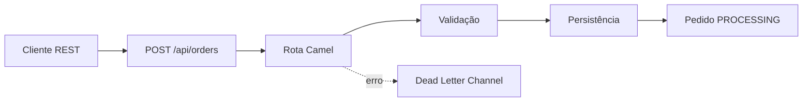

# Apache Camel — Guia e aplicação


[](https://adoptium.net/)
[](https://camel.apache.org/)
[](https://spring.io/projects/spring-boot)
[](https://docs.docker.com/compose/)

Este repositório combina um [**guia completo de Apache Camel**](./guia-apache-camel.md) com uma aplicação Java funcional. O objetivo é apresentar integração
enterprise de forma prática: uma rota Camel recebe pedidos por REST, valida os
dados, persiste o resultado e expõe métricas para operação.

## O que é Apache Camel?

Apache Camel é um framework open source para integração de sistemas. Ele
permite conectar APIs, bancos, arquivos, filas e serviços cloud por meio de
rotas e dos **Enterprise Integration Patterns (EIPs)**, sem acoplar a regra de
integração a um protocolo específico.

Uma rota Camel descreve o fluxo da mensagem:



O Camel oferece DSLs em Java, YAML e XML, centenas de componentes e padrões
como Content-Based Router, Splitter, Multicast, Circuit Breaker, Aggregator e
Dead Letter Channel.

## Conteúdo do guia

O arquivo [`guia-apache-camel.md`](./guia-apache-camel.md) é o material
principal deste projeto e cobre:

- fundamentos: `CamelContext`, rotas, `Exchange`, `Message`, headers e
  endpoints;
- configuração com Java 25, Maven, Camel CLI/JBang e DSL YAML;
- integrações com arquivos, Kafka, REST/HTTP, JDBC, OpenAI, S3 e FTP/SFTP;
- EIPs e estratégias de roteamento, transformação, enriquecimento e retries;
- externalização de configuração, idempotência, throttling e tratamento de
  erros;
- Camel K, Kubernetes, Knative e exemplos de deployment;
- observabilidade com Actuator, Micrometer, OpenTelemetry, JFR, Prometheus e
  dashboards;
- segurança, mascaramento de credenciais, hardening e verificação de CVEs;
- um apêndice com a estrutura de um projeto Camel completo.

Para consultar definições dos termos técnicos usados no guia e no código,
acesse o [Glossário Apache Camel e do projeto](./glossario.md).

> O guia documenta a linha Camel 4.22 LTS. O exemplo executável usa Camel
> 4.10.2, versão disponível no Maven Central no momento da criação, mantendo
> os mesmos conceitos e padrões do guia.

## Aplicação de exemplo: Camel Orders

A aplicação está em [`src/`](./src/) e foi construída com Spring Boot, Apache
Camel e Java 25. Ela mantém os pedidos em memória para ser executada sem
dependências externas, enquanto o Docker Compose disponibiliza PostgreSQL,
Kafka e um coletor OpenTelemetry para evoluções da integração.

### Endpoints

| Método | Endpoint | Descrição |
| --- | --- | --- |
| `POST` | `/api/orders` | Cria e valida um pedido |
| `GET` | `/api/orders` | Lista os pedidos processados |
| `GET` | `/api/orders/{id}` | Consulta um pedido pelo identificador |
| `GET` | `/actuator/health` | Verifica a saúde da aplicação |
| `GET` | `/actuator/metrics` | Lista métricas do Actuator |

Uma collection completa do Postman, incluindo cenários válidos, falhas de
validação, consulta de pedido inexistente e endpoints do Actuator, está em
[`postman/camel-orders.postman_collection.json`](./postman/camel-orders.postman_collection.json).
Importe também o ambiente
[`postman/camel-orders.postman_environment.json`](./postman/camel-orders.postman_environment.json)
para executar contra `http://localhost:8080`.

### Exemplo de criação

```bash
curl -i -X POST http://localhost:8080/api/orders \
  -H 'Content-Type: application/json' \
  -d '{
    "id": "pedido-001",
    "customerId": "cliente-123",
    "total": 125.50,
    "country": "BR"
  }'
```

Resposta esperada:

```json
{
  "id": "pedido-001",
  "customerId": "cliente-123",
  "total": 125.50,
  "country": "BR",
  "status": "PROCESSING"
}
```

### Consulta e listagem

```bash
curl http://localhost:8080/api/orders
curl http://localhost:8080/api/orders/pedido-001
curl http://localhost:8080/actuator/health
```

Pedidos sem `id`, `customerId` ou com `total` menor ou igual a zero são
rejeitados com HTTP 400:

```bash
curl -i -X POST http://localhost:8080/api/orders \
  -H 'Content-Type: application/json' \
  -d '{"id":"","customerId":"cliente-123","total":0}'
```

## Executar localmente

### Pré-requisitos

- JDK 25;
- Maven 3.9 ou superior;
- Docker e Docker Compose (opcionais para a stack de infraestrutura).

```bash
cp .env.example .env
mvn spring-boot:run
```

Em outro terminal, execute os exemplos de API acima. Para gerar o pacote:

```bash
mvn clean package
java -jar target/camel-orders-1.0.0.jar
```

## Testes

Os testes usam `CamelSpringBootTest` e `ProducerTemplate` para exercitar as
rotas diretamente, sem subir um servidor HTTP:

- `deveCriarEPersistirPedido`: valida o fluxo de criação e o status
  `PROCESSING`;
- `deveRejeitarPedidoInvalido`: valida o tratamento de entrada inválida.

Execute a suíte com:

```bash
mvn test
```

## Executar com Docker Compose

Copie as variáveis de exemplo e suba a aplicação:

```bash
cp .env.example .env
docker compose up --build
```

Serviços disponíveis:

| Serviço | Porta | Finalidade |
| --- | --- | --- |
| `camel-orders` | `8080` | Aplicação Camel e API REST |
| `postgres` | `5432` | Banco para a próxima etapa de persistência |
| `kafka` | `9092` | Broker para eventos e mensageria |
| `otel-collector` | `4317` | Coleta OTLP, no perfil opcional |

Para iniciar também a observabilidade:

```bash
docker compose --profile observability up --build
```

As variáveis estão em [`.env.example`](./.env.example). Nunca coloque
credenciais reais no Git; use `.env`, secrets do ambiente ou um gerenciador de
segredos.

## Estrutura do projeto

```text
.
├── guia-apache-camel.md
├── pom.xml
├── Dockerfile
├── docker-compose.yml
├── .env.example
└── src/
    ├── main/java/com/madrugas/
    │   ├── Application.java
    │   ├── model/Order.java
    │   ├── processor/OrderValidator.java
    │   ├── routes/OrderRoutes.java
    │   └── service/OrderRepository.java
    └── test/java/com/madrugas/routes/OrderRoutesTest.java
```

## Próximos passos

O exemplo é intencionalmente pequeno para facilitar o aprendizado. A partir
dele, consulte o guia para substituir o repositório em memória por JDBC,
publicar eventos no Kafka, adicionar autenticação, configurar OpenTelemetry e
preparar o deployment com Camel K/Kubernetes.
